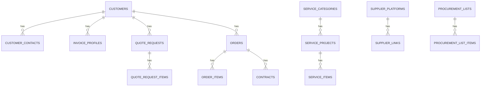

# 数据库表设计草案

## 1. 设计原则

- 数据库使用 `MySQL 8`
- 所有主表使用自增主键或雪花 ID，建议一期用自增主键配合业务编号
- 统一审计字段：
  - `id`
  - `created_at`
  - `updated_at`
  - `created_by`
  - `updated_by`
- 软删除字段可按模块选择性增加：
  - `deleted_at`

## 2. 核心实体关系

## 3. CMS 与基础配置

### 3.1 `cms_pages`

用途：存储官网静态页面主体内容

关键字段：

- `id`
- `page_key`
- `title`
- `subtitle`
- `content_json`
- `seo_title`
- `seo_description`
- `status`

### 3.2 `site_settings`

用途：存储公司基础信息和全局配置

关键字段：

- `id`
- `company_name`
- `company_short_name`
- `tax_number`
- `address`
- `phone`
- `mobile`
- `email`
- `bank_name`
- `bank_account`
- `website_title`
- `website_description`

说明：

- `bank_name` 和 `bank_account` 不建议直接用于官网公开展示
- 主要用于导出模板、合同、开票资料等内部场景

### 3.3 `cms_banners`

关键字段：

- `id`
- `page_key`
- `title`
- `subtitle`
- `image_url`
- `sort_order`
- `status`

### 3.4 `cms_faqs`

关键字段：

- `id`
- `category`
- `question`
- `answer`
- `sort_order`
- `status`

## 4. 服务目录

### 4.1 `service_categories`

关键字段：

- `id`
- `name`
- `slug`
- `description`
- `sort_order`
- `status`

### 4.2 `service_projects`

关键字段：

- `id`
- `category_id`
- `name`
- `description`
- `sort_order`
- `status`

### 4.3 `service_items`

关键字段：

- `id`
- `category_id`
- `project_id`
- `item_code`
- `name`
- `specification`
- `unit_price`
- `price_note`
- `status`
- `source_version`

说明：

- `item_code` 对应现有报价表中的货号，如 `GA1001`
- `source_version` 用于记录导入批次或报价版本

## 5. 客户与线索

### 5.1 `customers`

关键字段：

- `id`
- `name`
- `customer_type`
- `source`
- `industry`
- `address`
- `remark`

### 5.2 `customer_contacts`

关键字段：

- `id`
- `customer_id`
- `name`
- `phone`
- `email`
- `wechat`
- `title`
- `is_primary`

### 5.3 `messages`

用途：官网普通留言

关键字段：

- `id`
- `name`
- `phone`
- `email`
- `company_name`
- `message`
- `source`
- `status`

### 5.4 `quote_requests`

用途：客户从报价中心提交的询价单

关键字段：

- `id`
- `quote_no`
- `customer_id`
- `contact_name`
- `contact_phone`
- `contact_email`
- `company_name`
- `business_type`
- `source`
- `remark`
- `estimated_total_amount`
- `status`
- `owner_user_id`

建议枚举：

- `business_type`: `service`, `procurement`, `mixed`
- `source`: `quote_center`, `contact_form`, `manual`
- `status`: `pending`, `processing`, `converted`, `closed`

### 5.5 `quote_request_items`

关键字段：

- `id`
- `quote_request_id`
- `service_item_id`
- `item_name`
- `item_code`
- `specification`
- `unit_price`
- `quantity`
- `subtotal`

说明：

- 保留快照字段，避免后续服务价格调整影响历史询价

## 6. 发票与客户资料

### 6.1 `invoice_profiles`

关键字段：

- `id`
- `customer_id`
- `company_name`
- `tax_number`
- `address`
- `phone`
- `bank_name`
- `bank_account`
- `is_default`

## 7. 订单

### 7.1 `orders`

关键字段：

- `id`
- `order_no`
- `customer_id`
- `quote_request_id`
- `order_type`
- `project_name`
- `project_content`
- `amount`
- `has_contract`
- `has_delivery_note`
- `is_paid`
- `order_date`
- `invoice_profile_id`
- `owner_user_id`
- `remark`

建议枚举：

- `order_type`: `service`, `procurement`

### 7.2 `order_items`

关键字段：

- `id`
- `order_id`
- `item_type`
- `service_item_id`
- `supplier_link_id`
- `item_name`
- `item_code`
- `specification`
- `unit_price`
- `quantity`
- `subtotal`

说明：

- 技术服务订单和代采订单都可以通过 `item_type` 区分行项目

## 8. 合同与附件

### 8.1 `contracts`

关键字段：

- `id`
- `order_id`
- `customer_id`
- `contract_name`
- `description`
- `file_name`
- `file_url`
- `file_size`
- `storage_provider`
- `version_no`
- `uploaded_by`

### 8.2 `attachments`

用途：通用附件表，可服务于更多模块

关键字段：

- `id`
- `module_name`
- `record_id`
- `file_name`
- `file_url`
- `file_size`
- `mime_type`

## 9. 供应商与采购清单

### 9.1 `supplier_platforms`

关键字段：

- `id`
- `code`
- `name`
- `status`

建议初始数据：

- `rjmart`
- `casmart`
- `other`

### 9.2 `supplier_links`

用途：统一承接旧系统 `锐竟链接管理` 与 `喀斯玛链接管理`

关键字段：

- `id`
- `platform_id`
- `product_name`
- `product_code`
- `product_type`
- `sale_unit`
- `specification`
- `unit_price`
- `purchase_url`
- `image_url`
- `status`

### 9.3 `procurement_lists`

用途：保留并升级 `生成清单`

关键字段：

- `id`
- `list_no`
- `platform_id`
- `order_id`
- `quote_request_id`
- `customer_id`
- `title`
- `remark`
- `status`
- `export_file_url`

### 9.4 `procurement_list_items`

关键字段：

- `id`
- `procurement_list_id`
- `supplier_link_id`
- `product_name`
- `product_code`
- `product_type`
- `sale_unit`
- `specification`
- `unit_price`
- `quantity`
- `subtotal`
- `purchase_url`
- `remark`

说明：

- 同样保留快照字段，避免链接表后续变化影响历史清单

## 10. 后台账号与权限

### 10.1 `admin_users`

关键字段：

- `id`
- `username`
- `password_hash`
- `nickname`
- `email`
- `phone`
- `status`
- `last_login_at`

### 10.2 `roles`

关键字段：

- `id`
- `name`
- `code`
- `description`

### 10.3 `permissions`

关键字段：

- `id`
- `name`
- `code`
- `module`

### 10.4 `user_roles`

关键字段：

- `id`
- `user_id`
- `role_id`

### 10.5 `role_permissions`

关键字段：

- `id`
- `role_id`
- `permission_id`

### 10.6 `audit_logs`

关键字段：

- `id`
- `user_id`
- `module`
- `action`
- `target_id`
- `detail_json`
- `ip`

## 11. 数据迁移映射建议

### 11.1 旧订单表 -> 新 `orders`

- `项目名称` -> `project_name`
- `项目内容` -> `project_content`
- `客户信息` -> 客户拆分后写入 `customers`
- `金额` -> `amount`
- `是否有合同` -> `has_contract`
- `是否走锐竟` -> 参与 `order_type` 判断或代采标识判断
- `是否有送货单` -> `has_delivery_note`
- `下单日期` -> `order_date`
- `是否已收款` -> `is_paid`

### 11.2 旧发票抬头表 -> 新 `invoice_profiles`

直接迁移并尝试按单位名称归并到客户。

### 11.3 旧合同表 -> 新 `contracts`

- 文件迁移到对象存储
- 库内保留旧文件名和上传时间

### 11.4 旧锐竟/喀斯玛表 -> 新 `supplier_links`

- 旧 `锐竟链接管理` -> `platform_id = rjmart`
- 旧 `喀斯玛链接管理` -> `platform_id = casmart`

## 12. 索引建议

建议至少增加以下索引：

- `service_items(item_code)`
- `service_items(category_id, project_id, status)`
- `quote_requests(status, source, owner_user_id)`
- `orders(order_type, order_date, is_paid)`
- `customers(name)`
- `invoice_profiles(company_name, tax_number)`
- `supplier_links(platform_id, product_code)`
- `procurement_lists(platform_id, order_id)`

## 13. 备注

- 这是逻辑建模草案，不是最终 SQL。
- 建议下一步基于该文档输出 Prisma Schema 和迁移脚本草案。
