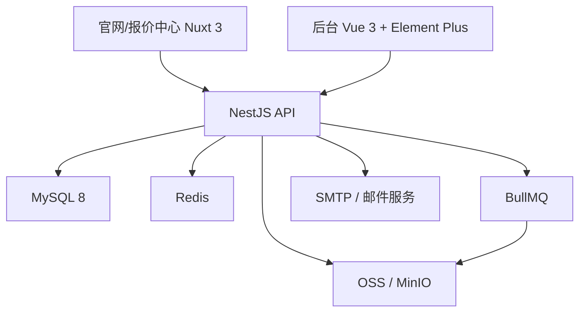
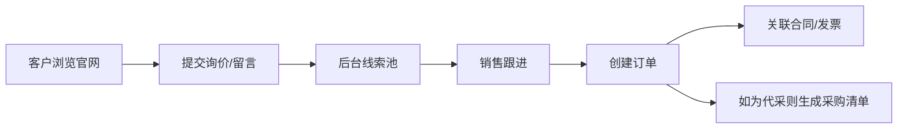
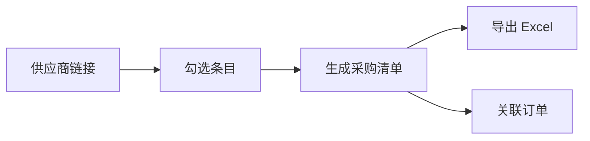

# 官网与后台系统设计文档

## 1. 设计目标

本系统采用统一平台、分角色入口的设计：

- 对外：官网与报价中心
- 对内：后台管理系统

设计原则：

- 一个业务后台统一管理官网内容、服务目录、询价、客户与订单
- 前后端分离，便于并行开发和后续扩展
- 保留旧业务能力，但重新梳理领域模型
- 一期避免微服务化，优先单体模块化架构

## 2. 总体架构

### 2.1 项目拆分

建议使用 `2 个前端项目 + 1 个后端项目`。

#### 前端项目 1

- 名称：官网与报价中心
- 域名：`www.subo.work`
- 技术栈：
  - Nuxt 3
  - TypeScript
  - Tailwind CSS

#### 前端项目 2

- 名称：后台管理系统
- 域名：`admin.subo.work`
- 技术栈：
  - Vue 3
  - Vite
  - Element Plus
  - Pinia

#### 后端项目

- 名称：统一业务 API
- 技术栈：
  - NestJS
  - Prisma
  - MySQL 8

### 2.2 推荐仓库结构

建议采用 `monorepo`：

```text
subo/
  apps/
    web/
    admin/
    api/
  packages/
    shared-types/
    ui-tokens/
  docs/
```

优点：

- 统一管理类型定义
- 统一 CI/CD
- 共享枚举、接口和设计变量

## 3. 中间件与基础设施

### 3.1 必需中间件

- MySQL 8
- Redis
- Nginx
- 对象存储：OSS / COS / MinIO

### 3.2 建议中间件

- BullMQ：异步任务队列
- Sentry：异常监控
- SMTP 或邮件服务：询价通知

### 3.3 中间件用途

#### MySQL

- 存储业务主数据
- 存储报价目录、订单、客户、合同、留言、询价等核心信息

#### Redis

- 登录态缓存
- 热门配置缓存
- 限流
- 队列依赖

#### BullMQ

- 采购清单导出
- 报价单导出
- 邮件发送
- 批量迁移任务

#### 对象存储

- 合同文件
- 官网图片
- 产品/供应商图片
- 导出的临时文件

## 4. 高层架构图



## 5. 领域模块设计

后端建议采用模块化单体。

### 5.1 CMS 模块

职责：

- 官网页面内容管理
- Banner、FAQ、联系方式管理

### 5.2 Service Catalog 模块

职责：

- 服务分类
- 服务项目
- 服务条目
- 报价目录

### 5.3 Quote 模块

职责：

- 报价单提交
- 报价条目明细
- 询价状态流转

### 5.4 CRM 模块

职责：

- 客户
- 联系人
- 发票抬头
- 留言

### 5.5 Order 模块

职责：

- 技术服务订单
- 代采订单
- 订单明细
- 订单状态

### 5.6 Procurement 模块

职责：

- 供应商平台
- 供应商链接
- 采购清单
- 清单导出

### 5.7 Contract 模块

职责：

- 合同上传
- 合同下载
- 合同与订单关联

### 5.8 IAM 模块

职责：

- 后台用户
- 角色
- 权限
- 操作日志

## 6. 关键业务设计

### 6.1 官网与报价中心整合

建议将现有报价系统的核心逻辑保留，但部署到官网主项目中，路径建议为：

- `/`
- `/services`
- `/procurement`
- `/quote`
- `/about`
- `/contact`

理由：

- 统一品牌
- 统一 SEO
- 统一视觉风格
- 统一数据接口

### 6.2 询价流转

业务链路：



### 6.3 采购清单生成

旧系统的 `锐竟/喀斯玛生成清单` 必须保留，新系统统一为：

- 供应商链接统一维护
- 采购清单按平台过滤生成
- 采购清单可关联询价或订单
- 支持导出 Excel

导出流程：



## 7. 鉴权与权限

### 7.1 鉴权方式

后台建议使用：

- JWT Access Token
- Refresh Token
- HttpOnly Cookie 或受控本地存储方案

### 7.2 权限模型

建议 RBAC：

- 超级管理员
- 销售/商务
- 运营
- 财务

权限粒度建议覆盖：

- 页面访问权限
- 数据查看权限
- 数据编辑权限
- 导出权限
- 删除权限

## 8. API 设计原则

### 8.1 接口风格

- RESTful 为主
- 文件上传单独处理
- 导出任务使用异步任务接口

### 8.2 示例接口分组

- `/api/public/*`
- `/api/admin/auth/*`
- `/api/admin/cms/*`
- `/api/admin/service-catalog/*`
- `/api/admin/quotes/*`
- `/api/admin/customers/*`
- `/api/admin/orders/*`
- `/api/admin/contracts/*`
- `/api/admin/procurement/*`

## 9. 文件与导出设计

### 9.1 文件类型

- 合同附件
- 官网图片
- 供应商产品图片
- 导出的采购清单

### 9.2 处理策略

- 文件元数据存数据库
- 文件实体存对象存储
- 导出文件走异步队列生成
- 提供短时下载链接

## 10. 数据迁移设计

### 10.1 迁移原则

- 先清洗，再导入
- 保留旧主键映射关系
- 对混合业务进行类型拆分
- 所有迁移过程可回溯

### 10.2 建议迁移步骤

1. 导出旧系统数据
2. 建立映射表
3. 清洗和标准化
4. 导入新库
5. 抽样核对
6. 补录异常数据

### 10.3 重点迁移难点

- 旧订单中技术服务与代采订单混用
- 锐竟/喀斯玛数据结构统一
- 发票抬头与客户实体的归并
- 合同文件的存储迁移

## 11. 部署建议

### 11.1 环境

- 开发环境
- 测试环境
- 生产环境

### 11.2 域名规划

- `www.subo.work`：官网
- `admin.subo.work`：后台
- `api.subo.work`：API，可选

### 11.3 部署方式

建议使用 Docker Compose 或容器化部署：

- web
- admin
- api
- mysql
- redis
- worker
- nginx

## 12. 技术选型理由

### Nuxt 3

- 适合官网 SEO
- 适合内容展示与营销页面
- 可直接承载报价中心

### Vue 3 + Element Plus

- 与旧后台交互风格衔接自然
- 适合管理系统快速开发

### NestJS

- 模块化清晰
- 适合中后台业务
- 便于后续加权限、任务队列、文件处理

### MySQL

- 团队使用习惯明确
- 一期业务复杂度完全可覆盖
- 与 Prisma 配合成熟

## 13. 一期不建议做的复杂化设计

- 微服务拆分
- 事件总线过度设计
- 搜索引擎单独部署
- 客户前台账号中心
- 复杂审批流

一期目标是先把品牌展示、报价闭环、后台经营管理做稳。
